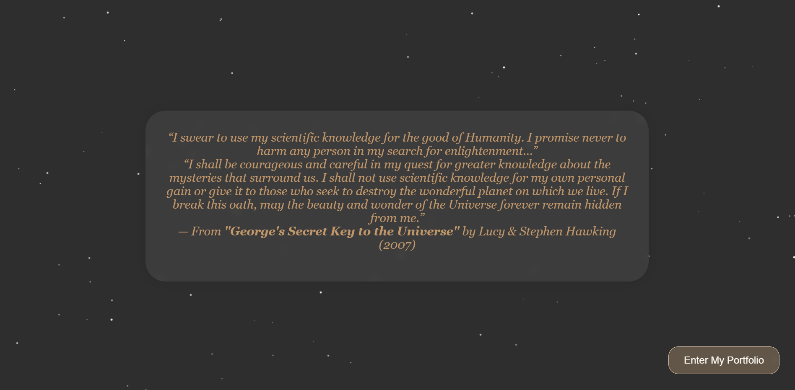
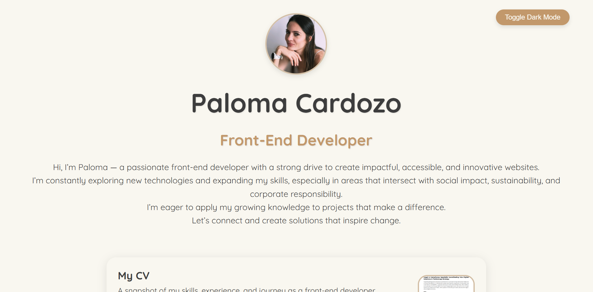

# 🌱 Paloma Cardozo – Front-End Developer Portfolio

This is my personal **portfolio website**, designed to present my projects, technical progress, and purpose as a front-end developer passionate about accessibility, responsible tech, and social impact.

This site is more than a portfolio — it's a reflection of my commitment to **tech for good**, optimized code, and inclusive design. It includes interactive elements, dark mode, animated transitions, and ESG-themed microcopy on each project.

## Table of Contents

- [Overview](#overview)
  - [Screenshot](#screenshot)
  - [Links](#links)
- [My Process](#my-process)
  - [Built With](#built-with)
  - [Features](#features)
  - [What I Learned](#what-i-learned)
  - [Continued Development](#continued-development)
  - [Useful Resources](#useful-resources)
- [Author](#author)
- [Acknowledgments](#acknowledgments)

## Overview

### 📸 Screenshots

**Intro Section with ESG Oath**  

**Main Portfolio with Projects**  

### 🔗 Links

- **Live Site**: [paloma-cardozo.github.io/dev-portfolio](https://paloma-cardozo.github.io/dev-portfolio/)
- **Repository**: [github.com/Paloma-Cardozo/dev-portfolio](https://github.com/Paloma-Cardozo/dev-portfolio)

## My Process

### 🛠️ Built With

- Semantic **HTML5**
- Custom **CSS Variables**
- **Flexbox** layout
- **Media Queries** for responsive design
- Vanilla **JavaScript** (no frameworks)
- **EmailJS** for form submissions
- **GoatCounter** for privacy-focused analytics
- **Git & GitHub** for version control

### ✨ Features

- 🌓 Light/Dark mode toggle  
- 🎇 Animated intro section with a cosmic ESG oath  
- 📂 Cards loaded dynamically with JavaScript  
- ♿ Accessible forms with client-side validation  
- 🧭 Smooth transitions between sections  
- 🔄 Visit counter with localStorage  
- 🌍 Microcopy aligned with ESG goals (sustainability, inclusion, transparency)  
- 📱 Fully responsive and mobile-first  

### 💡 What I Learned

- How to create **smooth page transitions** between intro and main content  
- How to build **flexible, reusable card components** with clean visual hierarchy  
- How to implement **client-side form validation** and third-party services like EmailJS  
- How to ensure **keyboard accessibility**, semantic structure, and focus states  
- How to optimize CSS for **readability, performance, and aesthetics**  
- How to express personal values through **design and interaction**

### 🔄 Continued Development

- Improve project filtering and sorting system  
- Add Danish and Spanish localization  
- Refactor with accessibility testing tools  
- Expand to include **blog posts on ESG + tech**
- Possibly adapt the design for a **Progressive Web App**

### 📚 Useful Resources

- [MDN Web Docs](https://developer.mozilla.org) – HTML, CSS, JavaScript standards  
- [CSS Tricks](https://css-tricks.com/) – Layouts, tips and advanced styling  
- [Google Fonts](https://fonts.google.com/) – Typography used  
- [GoatCounter](https://www.goatcounter.com/) – Simple, privacy-focused analytics  
- [EmailJS](https://www.emailjs.com/) – Send emails from the frontend  

## 👩‍💻 Author

**Paloma Cardozo**  
- Frontend Mentor – [@Paloma-Cardozo](https://www.frontendmentor.io/profile/Paloma-Cardozo)
- GitHub URL – [Paloma-Cardozo](https://github.com/Paloma-Cardozo)
- LinkedIn - [Paloma-Cardozo/](https://www.linkedin.com/in/paloma-cardozo/)

Frontend Developer focused on learning, ethics, and tech for good 🌍  
Created with love, curiosity, and purpose 💛  

## 🙏 Acknowledgments

To my husband and daughter: thank you for your love, belief, and patience.  
To the ReDI School and everyone who supports inclusive tech education — this site is part of your legacy.
